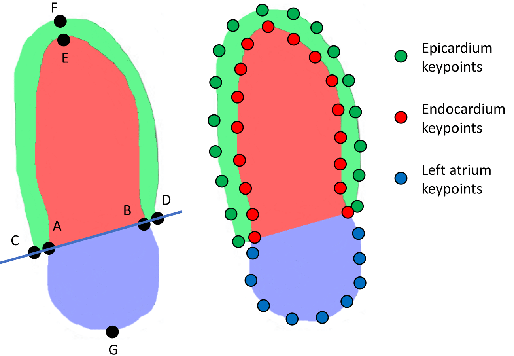
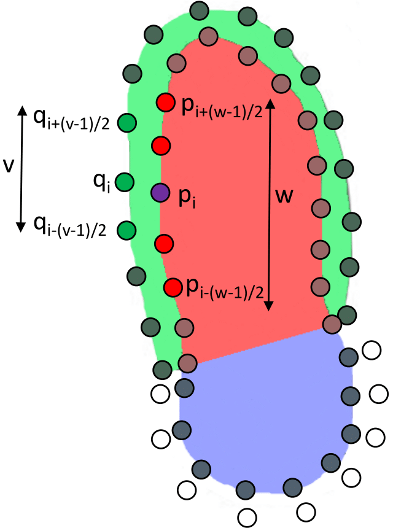
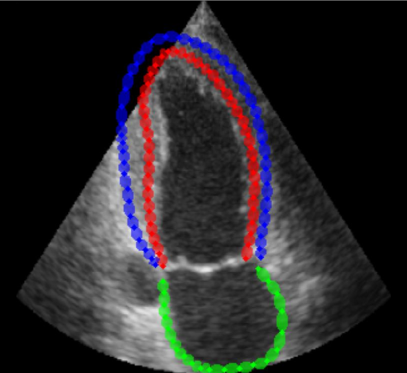

In this file necessary steps are described to run a training for EchoGraphs on the EchoNet data and evaluate the results

## Set up enviroment

1) Install all required packages
2) Modify CONST.py to set all global path variables to your personal code and data location.

## Preprocess the CAMUS dataset
The CAMUS dataset can be downloaded from https://www.creatis.insa-lyon.fr/Challenge/camus/.

The downloaded folder ``` database_nifti ``` either needs to be placed
in the folder ``` data/local_data ``` or the variable ```input_dir``` needs to be changed to the location of the folder
in the file ``` tools/preprocess_camus.py ``` or ``` tools/preprocess_camus_displacement.py ```.


The dataset is provided as a zip file containing the images and annotations. The annotations are provided as pixel-wise labels of the
left ventricle (LV), left atrium (LA), and myocardium (MYO), split into 10 folds for cross validation.

The folder ``` data/subgroups_CAMUS ``` defines the cross-validation subgroups of the CAMUS 
dataset that are used for training and testing.

To preprocess the dataset for double ring architectures, run the following command:

```PYTHONPATH=./ python tools\preprocess_camus.py ```

To preprocess the dataset for displacement architectures, run the following command:

```PYTHONPATH=./ python tools\preprocess_camus_displacement.py ```


## Run training using config files
This framework is taken from the EchoGraphs repository:
https://github.com/guybenyosef/EchoGraphs.git

This framework is built on the use of ConfigNodes that can be conviniently loaded using .yaml files. Those config files allow the user to set up own configurations and changing configurations by parsing parameters on the command line.

To use the default configuration, you can simply run:

```python train.py```


If you want to specify your own configuration, you can run:

```python train.py --config_file path/to/your/config.yaml```


which executes the train script with parameters specified in the config.
In configs/defaults.py you can see an overview on all default parameters that can be modified by custom yaml files.

The training script can be started with various parameters (all specified in the config files) to adjust the model 
or the hyperparameter to fit your needs. You can select different models, different backbones 
(i.e. mobilenet2 for a pretrained mobilenet version 2) and different datasets.
We also integrated different augmentation bundles and achieved best results with the configuration 
'strongkeep'. You can further select the probability of the applied augmentation.




Preprocessing to transform pixel labels to key-
points positions. A and B are the base points of the LV. C and
D are the base points of the MYO. E, F, and G are the apexes
of the LV, MYO, and LA respectively.
The algorithm first finds point A and B where the LV and LA meet.
Then it finds points C and D by extending the line between A and B.
Finally, it finds points E, F, and G as the most distant points from A and B.


## Overview different models
All model configurations can be found in the file ```models.py```. 


### Double ring models
These methods predict the coordinates of each of the keypoints ordered in two concentric rings.
The inner ring consists of the left ventricle (LV) and left atrium (LA), the outer ring consists
of the epicardium (EP) 

- GCN_multi_large: 7 decoder layers
- GCN_multi_medium: 4 decoder layers
- GCN_multi_small: 2 decoder layers
- no_decoder: no decoder layers



Multi-structure convolution. q1..n are zero-padded epicardium keypoints,
p1..n are endocardium and left atrium keypoints. 
The highlighted points are used as input
to update the embedding of the purple keypoint, with w the
primary receptive field and v the secondary receptive field.





Example output of the double ring model. 
The output of the model are the x and y coordinates of the keypoints.
The keypoints are ordered in two concentric rings.
The inner ring consists of the left ventricle (red) and left atrium (green), the outer ring consists
of the epicardium (blue)


### Displacement models
These methods predict the coordinates of each of the keypoints from the inner ring (LV+LA) and predicts
the displacement of the keypoints from the outer ring (EP) to the inner ring (LV+LA).

- GCN_multi_displacement_large: 7 decoder layers
- GCN_multi_displacement_medium: 4 decoder layers
- GCN_multi_displacement_small: 2 decoder layers
- no_decoder_displacement: no decoder layers


Example output of the displacement model. 
The output of the model are the x and y coordinates fo the inner keypoints plus the 
normal displacement of the outer keypoints to the inner keypoints. The inner keypoints
conist of the left ventricle (red) and left atrium (green), the outer keypoints conist
of the epicardium (blue).

### Remaining models

The remaining models are the architectures provided by S. Thomas, A. Gilbert, and G. Ben-Yosef from: 
https://github.com/guybenyosef/EchoGraphs.git
For usage of these models, please consult the original repository.


## Default Configuration

The default configuration for training used the config file ```files/configs/Train_displacement_CAMUS.yaml```
for training and the config file ```files/configs/Eval_CAMUS_displacement.yaml``` for evaluation.
It uses the GCN_multi_small model with the mobilenet2 backbone and the strongkeep augmentation bundle.

## Pretrained models
The default mode trained on the first split of the CAMUS dataset can be downloaded from
https://huggingface.co/gillesvdv/GCN_with_displacement_camus_cv1. 
place the .pth file in 
``` experiments/logs/CAMUS_displacement_cv_1/GCN_multi_displacement_small/mobilenet2/trained/ ```
Now you can run the default eval configuration to evaluate the model.

Information on the CAMUS cross validation splits can be found in ``` files/listSubGroups ```.


## Monitor training 
You can monitor your results using tensorboard. Depending on your model choice, the mean kpts (averaged over all keypoints), ef (regressed value) and sd (classified frame) error can be tracked for validation.

```tensorboard --bind_all --load_fast=false --logdir= PATH_TO_EXPERIMENT_DIRECTORY```


## Run evaluation

To use the default configuration, you can simply run:

```python eval.py```

If you want to specify your own configuration, you can run:

```python eval.py --config_file Path/To/Your/EvalConfig.yaml ```

The configuration mechanism is the same as for the training script. 
You can specify your own configuration file or use the default configuration file.
