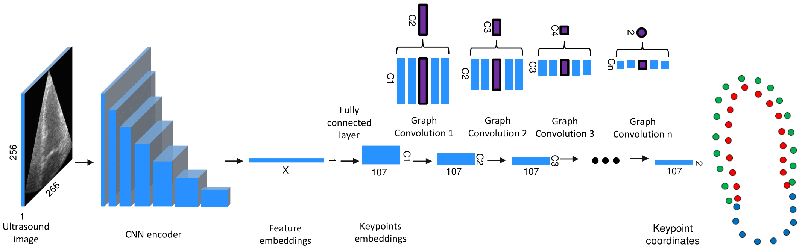
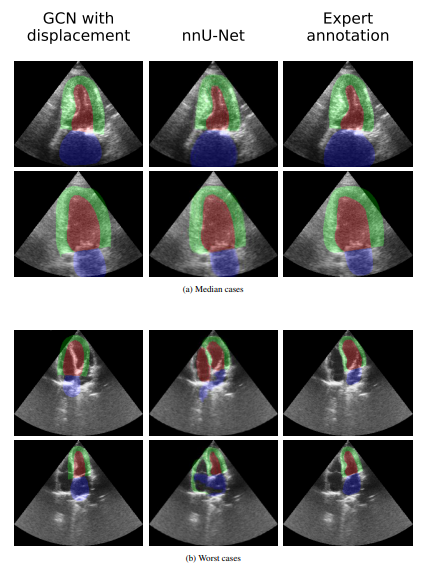

# Towards Robust Cardiac Segmentation using Graph Convolutional Networks

This repository is the source code for the training framework of [Towards Robust Cardiac Segmentation using Graph Convolutional Networks](https://arxiv.org/abs/2310.01210).

## Code of the architecture as a modular entity
If you want to use the architecture in your own project, you can use the architecture as a modular entity as provided in 
https://github.com/gillesvntnu/GraphBasedSegmentation.git. The code in that repository contains the isolated code for 
the arhictecture only, so you can insert it in any PyTorch framework.

## Real-time demo
For code of the real-time, c++ demo of inter model agreement, see 
https://github.com/gillesvntnu/GCN_UNET_agreement_demo.git


The GCN and nnU-Net segmentations are shown on the left
and right side respectively. The color-coded status bar on top
visualizes the agreement between the models. The full demo video
is availabel at https://doi.org/10.6084/m9.figshare.24230194.

## Quickstart
See [QUICKSTART.md/](./QUICKSTART.md) to get started with the default configuration.


## Introduction
Fully automatic cardiac segmentation can be
a fast and reproducible method to extract clinical measure-
ments from an echocardiography examination. The U-Net
architecture is the current state-of-the-art deep learning
architecture for medical segmentation and can segment
cardiac structures in real-time with average errors below
inter-observer variability. However, this architecture still
generates large outliers that are often anatomically incor-
rect. This work expands the concept of graph convolutional
neural networks that predict the contour points of the struc-
tures of interest instead of labelling each pixel. We pro-
pose a graph architecture that uses two convolutional rings
based on cardiac anatomy and show that this eliminates
anatomical incorrect segmentations on the publicly avail-
able CAMUS dataset. Additionally, this work contributes
with an ablation study on the graph convolutional archi-
tecture and an evaluation of clinical measurements on the
large clinical HUNT4 dataset. Finally, we propose to use the
inter-model agreement of the U-Net and the graph network
as a predictor of both the input and segmentation quality.
We show this predictor can detect out-of-distribution and
unsuitable input images in real-time. For the full article,
see [Towards Robust Cardiac Segmentation using Graph Convolutional Networks](https://arxiv.org/abs/2310.01210).

## Acknowledgements
This work extends the framework provided by 
- S. Thomas, A. Gilbert, and G. Ben-Yosef: “Light-weight spatio-temporal
graphs for segmentation and ejection fraction prediction in cardiac
ultrasound” in Medical Image Computing and Computer Assisted
Intervention–MICCAI 2022: 25th International Conference, Singapore
https://github.com/guybenyosef/EchoGraphs.git

The code expands the model to multi structure segmentation and provides
functionality to convert pixel-wise segmentation maps annotations to 
clinically motivated keypoint annotations.


## Dataset
This repository contains code to train and test the GCN model on the CAMUS dataset.
The CAMUS dataset is a publicly available
dataset of 500 patients including Apical 2 Chamber (A2C)
and Apical 4 Chamber (A4C) views obtained from a GE Vivid
E95 ultrasound scanner, equalling 2000 image annotation pairs. The annotations are available as pixel-wise labels of the
left ventricle (LV), left atrium (LA), and myocardium (MYO),
split into 10 folds for cross-validation
The CAMUS dataset is available at https://www.creatis.insa-lyon.fr/Challenge/camus/.

- S. Leclerc, E. Smistad, J. Pedrosa, A. Østvik, F. Cervenansky, F. Espinosa, T. Espeland, E. A. R. Berg, P.-M. Jodoin, T. Grenier et al.,
“Deep learning for segmentation using an open large-scale dataset in
2d echocardiography,”

Information on the CAMUS cross validation splits can be found in ``` files/listSubGroups ```.

## Architecture


The architecture of the GCN. The CNN encoder transforms the input ultrasound image of width W and height
H to an embedded vector of size X. A dense layer transforms this embedding to an embedding in keypoint space, with 107
keypoints and C1 channels. The decoder consists of a sequence of graph convolutions over these keypoint embeddings. The
final outputs are the 2D coordinates of the keypoints in the image.
## Results



Case analysis and comparison of the GCN with displacement method and nnU-Net on CAMUS. The cases are
selected based on the overall Dice score between the annotation and the GCN or U-Net segmentations.


## Environment
See [INSTALL.md/](./INSTALL.md) for environment setup.

## Getting stated
See [GETTING_STARTED.md](./GETTING_STARTED.md) to get started with training and testing the GCN model. 

## Contact

Developer: <br />
gillesvandevyver@hotmail.be <br />
https://www.linkedin.com/in/gilles-van-de-vyver/

Management: <br />
lasse.lovstakken@ntnu.no <br />
erik.smistad@ntnu.no <br />


